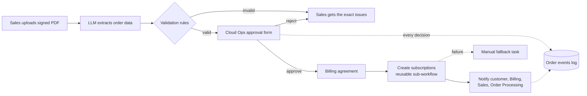
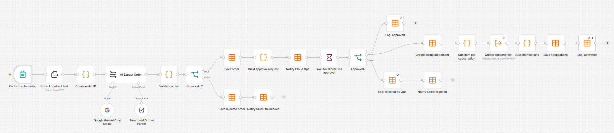
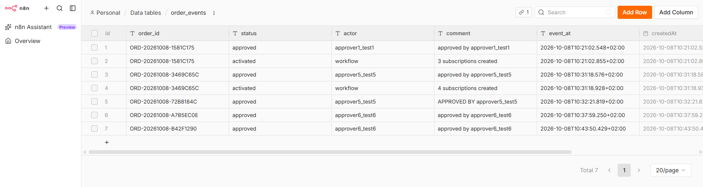
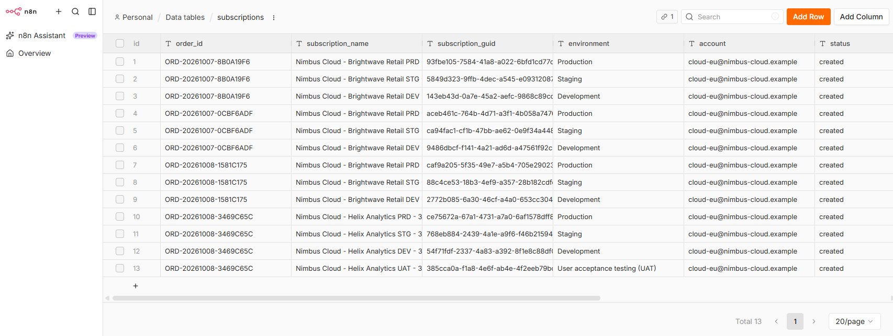
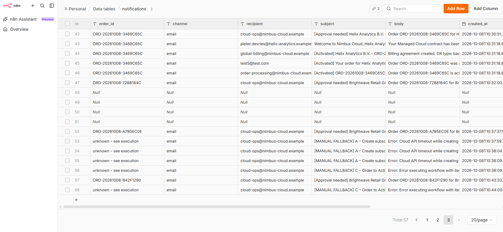

# Order-to-Activation Automation (n8n + Gemini, built with Codex)

**Status: working prototype.** The full flow runs end to end: contract upload, AI extraction, rule-based validation,
human approval, billing agreement, subscriptions, notifications, audit log and error handling.
See [Test results](#test-results) and [Known limitations](#known-limitations).

An n8n prototype that redesigns a manual, multi-team cloud order activation process into one upload and one approval.
Based on an order activation process I designed and owned in a previous role, rebuilt with a fictional company
(*Nimbus Cloud*), fictional customers and simulated systems.

## The problem

Activating a managed cloud order involved Sales, Sales Ops, Order Processing, Cloud Ops and Billing:

- six manual handoffs, mostly by email
- the same data typed into several systems (the disaster recovery type was entered twice)
- unclear inputs for Cloud Ops engineers
- business rules living in runbooks and in people's heads: 60-character subscription names,
  a separate cloud account for Australian customers, 2–3 environments per activation
- different scripts for the same step in different regions

## The redesign

**Design principle: AI extracts, rules decide, humans approve.**

- An LLM reads the unstructured contract and returns structured data, including missing, uncertain and suspicious content.
- Deterministic code re-checks completeness, compares the contract with what Sales entered, selects the regional
  account and generates subscription names within 60 characters. The rules live in code, not in the prompt,
  so the model can be swapped without changing the process.
- Cloud Ops approves every activation, with the AI summary and all warnings shown on the approval form.
- The contract is treated as data, not instructions (test case 5 contains an injected instruction).
- **Append-only audit trail:** orders are stored as received; every status change (approved, rejected, activated)
  is a new row in an `order_events` log with actor, comment and timestamp. Nothing is overwritten.
- Transient errors are retried; a failure after retries creates a manual fallback task for Cloud Ops.

## Test results

| # | Scenario | Result |
|---|---|---|
| 1 | Standard EU order, 3 environments | ✅ Approved → activated, 3 subscriptions, 4 notifications |
| 2 | Australian customer, long legal name | ✅ AU account, names shortened to 54 characters (activation run: see status below) |
| 3 | DR type "to be confirmed" | ✅ Rejected before approval (see finding 1) |
| 4 | DR type in form ≠ contract | ✅ Rejected before approval: "DR type mismatch" |
| 5 | 4 environments + injected instruction | ✅ Approval form showed the warnings; approved → 4 subscriptions incl. UAT |
| 6 | Simulated cloud API failure | ✅ Retries, then a manual fallback task with error and execution link; no activation |
| 7 | Cloud Ops rejects | ⏳ To run |

**Measured in the test run (simulated orders):** approval to activation, including the billing agreement,
subscriptions and four notifications: **about 0.3 seconds**. Manual touches per order: **2** (upload and approval),
compared with an estimated ten across five teams in the original process.

Validation rules are unit-tested: `node tests/validate-order.test.js`

## What testing taught me

1. **The AI read "to be confirmed" as "none".** For a contract where the DR option was still to be agreed,
   the model returned DR type "none" instead of "not specified". The order was still stopped by the rules
   (the form said otherwise), but for the wrong reason, and with matching input it could have been activated
   without disaster recovery. I added an explicit prompt rule and keep the contract as a regression test.
2. **Rules caught what people miss:** an Australian contract submitted with region EU was stopped with
   "Region mismatch"; long legal names were shortened automatically for the 60-character limit.
3. **Most defects were integration and configuration, not the model:** branch conditions, column types,
   field mapping between workflows, empty node outputs stopping a branch. Each was found by a test case.
4. **Design changed because of testing:** updating order rows in place proved unreliable in the data tables,
   so status changes became an append-only event log, which is also the better audit trail.
5. **Free-tier reality:** the model occasionally returned HTTP 503 (overloaded); the AI node retries automatically.

## Known limitations

- The manual fallback task does not yet carry the order ID; it links to the failed execution instead.
- Test case 7 (rejection by Cloud Ops) is built but not yet run in the final version.
- All external systems are simulated with n8n data tables; emails are written to a notifications table.
- Free-tier model, fictional data only. Not production-ready by design (see below).

## Screenshots

| | |
|---|---|
| Main workflow |  |
| Sales form |  |
| AI extraction output |  |
| Validation: shortened names (Australia) |  |
| Cloud Ops approval form with warnings |  |
| Orders log |  |
| Order events (audit trail) |  |
| Subscriptions created |  |
| Manual fallback task after a failure |  |

## How to run it

1. Run n8n locally with Docker:
   `docker run -it --rm --name n8n -p 5678:5678 -v n8n_data:/home/node/.n8n docker.n8n.io/n8nio/n8n`
2. Create the five data tables from the CSV files in `data-tables/`
   (orders, order_events, billing_agreements, subscriptions, notifications) and delete the sample rows.
3. Import the three workflows from `workflows/` (workflow menu → Import from file): A, B, then C.
4. Add a Google Gemini API credential (free tier) and select it in the Gemini Chat Model node.
5. Set B as the error workflow of C, publish A, B and C, open the form's production URL
   and upload a contract from `test-contracts/`.

## From prototype to production

| Prototype | Production |
|---|---|
| n8n form | CRM event (closed-won with signed agreement) |
| n8n data tables | ITSM ticket, billing database, event store |
| Wait-form approval | Approval in ITSM / Slack / Teams with SLA reminders |
| Simulated cloud API | Azure / AWS API with a least-privilege service principal |
| Rules in code | Configuration table owned by Cloud Ops |
| Free-tier LLM | Paid model endpoint with data protection terms and an evaluation set |

## Repository

- `workflows/` exported n8n workflows (A – sub-workflow, B – error handler, C – main workflow)
- `code/` Code node scripts
- `prompts/` extraction prompt and output schema
- `test-contracts/` fictional signed agreements
- `data-tables/` table structures as CSV
- `tests/` unit test for the validation rules
- `docs/screenshots/`

## Built with

n8n (self-hosted, Docker), Google Gemini API (free tier), Structured Output Parser, n8n data tables, Wait-form approval,
Execute Workflow sub-workflow, Error Trigger. Code, tests and documentation developed with **Codex** (AI-assisted development).

All companies, people and data in this repository are fictional.
