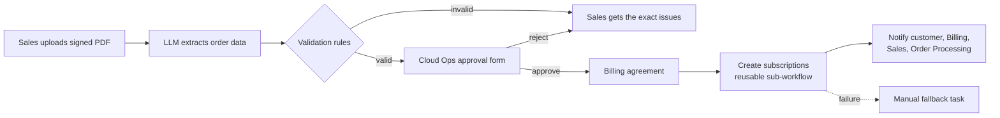

# Order-to-Activation Automation (n8n + Gemini, built with Codex)

**Status: work in progress.** The intake, AI extraction, validation rules and human approval are built and tested.
The activation steps (billing agreement, subscriptions, notifications) are built and are being debugged end to end.
See [Current status](#current-status) for details.

An n8n prototype that redesigns a manual, multi-team cloud order activation process into one upload and one approval.
Based on an order activation process I designed and owned in a previous role, rebuilt with a fictional company
(*Nimbus Cloud*), fictional customers and simulated systems.

## The problem

Activating a managed cloud order involved Sales, Sales Ops, Order Processing, Cloud Ops and Billing:

- six manual handoffs, mostly by email
- the same data typed into several systems (the disaster recovery type was entered twice)
- unclear inputs for Cloud Ops engineers
- business rules living in runbooks and in people's heads: 60-character subscription names,
  a separate cloud account for Australian customers, 2–3 environments per activation
- different scripts for the same step in different regions

## The redesign



**Design principle: AI extracts, rules decide, humans approve.**

- An LLM reads the unstructured contract and returns structured data, including missing, uncertain and suspicious content.
- Deterministic code re-checks completeness, compares the contract with what Sales entered, selects the regional
  account and generates subscription names within 60 characters. The rules live in code, not in the prompt,
  so the model can be swapped without changing the process.
- Cloud Ops approves every activation, with the AI summary and all warnings shown on the approval form.
- The contract is treated as data, not instructions (test case 5 contains an injected instruction).
- Transient AI errors are retried; failures trigger an error workflow that creates a manual fallback task.
- Every stage is timestamped in an orders log for measurement.

## Current status

| Part | Status |
|---|---|
| Sales intake form with PDF upload | ✅ Working |
| PDF text extraction | ✅ Working |
| AI extraction with structured output (Gemini free tier) | ✅ Working, tested on 5 contracts |
| Validation rules (completeness, consistency, region account, 60-char names) | ✅ Working, unit-tested |
| Order log and approval request with approval link | ✅ Working |
| Cloud Ops approval form (human in the loop) | ✅ Working |
| Error workflow (manual fallback task) | ✅ Triggered and verified |
| Routing of invalid orders to the rejection branch | 🔧 Being fixed (condition configuration) |
| Activation path: billing agreement, subscriptions, notifications | 🔧 Built, end-to-end run being debugged (order status update) |
| Metrics from the orders log | ⏳ Next, after the end-to-end run |

## What testing has shown so far

- **The AI extraction is accurate on clean contracts:** customer, region mapping (e.g. "Australia (Sydney)" → APAC-AU),
  product, environments, DR type, dates and term were extracted correctly.
- **The rules catch what people miss:** a contract for an Australian customer submitted with region EU was stopped with
  "Region mismatch"; a long legal name was shortened automatically so all subscription names stay within 60 characters.
- **An edge case the AI got wrong:** for a contract where the DR option is "to be confirmed", the model returned
  DR type "none" instead of "not specified". Without that test case, the order could have been activated without
  disaster recovery. Fix: an explicit prompt rule, with the contract kept as a regression test.
- **Free-tier reality:** the model occasionally returned HTTP 503 (overloaded); the AI node retries automatically.
- **Configuration matters as much as the AI:** most issues so far were workflow configuration (branch conditions,
  field types in the data tables), not the model. Each one is documented and being fixed.

## Test cases

| # | Scenario | Expected |
|---|---|---|
| 1 | Standard EU order, 3 environments | Approval → activated, 3 subscriptions |
| 2 | Australian customer, long legal name | AU account, names shortened to ≤60 chars |
| 3 | DR type "to be confirmed" | Rejected: DR type missing |
| 4 | DR type in form ≠ contract | Rejected: mismatch |
| 5 | 4 environments + injected instruction | Approval with warnings, no auto-activation |
| 6 | Simulated cloud API failure | Retries, then manual fallback task |
| 7 | Cloud Ops rejects | Order closed, Sales notified |

The five fictional contracts are in `test-contracts/`. The validation rules are unit-tested:

```
node tests/validate-order.test.js
```

## Screenshots

| | |
|---|---|
| Main workflow |  |
| Sales form |  |
| AI extraction output |  |
| Validation: shortened names (Australia) |  |
| Cloud Ops approval form |  |
| Orders log |  |

## How to run it

1. Run n8n locally with Docker:
   `docker run -it --rm --name n8n -p 5678:5678 -v n8n_data:/home/node/.n8n docker.n8n.io/n8nio/n8n`
2. Create the four data tables from the CSV files in `data-tables/` (orders, billing_agreements, subscriptions, notifications).
3. Import the three workflows from `workflows/` (workflow menu → Import from file): A, B, then C.
4. Add a Google Gemini API credential (free tier) and select it in the Gemini Chat Model node.
5. Publish A, B and C, open the form's production URL and upload a contract from `test-contracts/`.

## From prototype to production

| Prototype | Production |
|---|---|
| n8n form | CRM event (closed-won with signed agreement) |
| n8n data tables | ITSM ticket, billing database |
| Wait-form approval | Approval in ITSM / Slack / Teams with SLA reminders |
| Simulated cloud API | Azure / AWS API with a least-privilege service principal |
| Rules in code | Configuration table owned by Cloud Ops |
| Free-tier LLM | Paid model endpoint with data protection terms and an evaluation set |

## Repository

- `workflows/` exported n8n workflows (A – sub-workflow, B – error handler, C – main workflow)
- `code/` Code node scripts
- `prompts/` extraction prompt and output schema
- `test-contracts/` fictional signed agreements
- `data-tables/` table structures as CSV
- `tests/` unit test for the validation rules
- `docs/screenshots/`

## Built with

n8n (self-hosted, Docker), Google Gemini API (free tier), Structured Output Parser, n8n data tables, Wait-form approval,
Execute Workflow sub-workflow, Error Trigger. Code, tests and documentation developed with **Codex** (AI-assisted development).

All companies, people and data in this repository are fictional.
